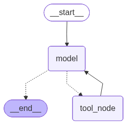

# HCP Interaction Logger

An AI-assisted sales enablement tool that lets pharma/medical field reps log their
Healthcare Professional (HCP) interactions **either through a structured form or a
free-form conversational chat** — with a LangGraph agent keeping both views in sync.

---

## 1. What this project does

Field reps need to record every HCP touchpoint (calls, office visits, conferences,
sample drops, etc.) for compliance and CRM purposes. Typing the same details into a
rigid form is slow, so this project offers a **"Log Interaction" screen** with two
panels that always reflect the same underlying draft:

- **Chat panel** — the rep types a natural-language description
  ("Met Dr. Smith today, discussed Product X efficacy, shared brochures, positive
  sentiment, agreed to reconnect in two weeks"), and a LangGraph agent parses it,
  calls the right tool, and updates the form.
- **Form panel** — a normal structured form showing the same fields
  (`hcp_name`, `interaction_type`, `interaction_date`, `interaction_time`,
  `attendees`, `materials_shared`, `samples_distributed`, `hcp_sentiment`,
  `outcomes`, `follow_up_actions`). Any change the agent makes updates this
  panel automatically; the rep never has to fill it in by hand.

The user can freely go back and forth: describe something in chat, see the form
populate, ask for a correction ("actually it was negative sentiment"), add a
follow-up ("also remind me to send the dosage guide"), or type `done` to validate
and submit.

---

## 2. Tech stack

| Layer            | Choice                                          |
|------------------|--------------------------------------------------|
| Frontend         | React + Redux Toolkit (Vite)                     |
| Backend          | Python, FastAPI                                  |
| AI orchestration | LangGraph (agent + tool graph)                   |
| LLM provider     | Groq — `gemma2-9b-it` (primary), `llama-3.3-70b-versatile` (fallback / dev) |
| Database         | PostgreSQL (via Docker Compose)                  |

> **Note:** the reference agent code in this repo is wired to
> `llama-3.3-70b-versatile` for development. Swap the `model=` argument in
> `server/agent/index.py` to `gemma2-9b-it` (or make it env-configurable) once
> you generate your Groq API key at https://console.groq.com/keys.

---

## 3. Role of the LangGraph agent

The agent is the single source of truth for **how** a user's message turns into a
form update. It never lets the LLM freely rewrite the whole form; instead it:

1. Reads the running chat history + the current form state.
2. Uses `llm.bind_tools(...)` to decide **which single capability** (tool) the
   user's message maps to — log, edit, manage follow-ups, reset, or validate.
3. Delegates the actual field extraction to that tool, which runs its own
   narrowly-scoped LLM prompt (e.g. the edit tool only ever sees "what changed",
   not the whole form again).
4. Merges the tool's output into `form_data` in the graph state and loops back
   to the model node so it can produce a short, human-readable summary of what
   changed and prompt the user for the next step.
5. Stops (`END`) as soon as the model responds with plain text instead of a
   tool call — that's the natural point to hand control back to the user.

This keeps every write to the form auditable (each tool call is a discrete,
typed operation) instead of relying on the LLM to freehand JSON for the entire
form on every turn.

### Graph shape



---

## 4. Tools available to the agent

| # | Tool                        | Purpose |
|---|------------------------------|---------|
| 1 | **`log_interaction_tool`**   | Creates/extracts a brand-new interaction from a raw message. |
| 2 | **`edit_interaction_tool`**  | Corrects a single scalar field on an existing interaction. |
| 3 | `manage_follow_up_tool`     | Adds, removes, or replaces items in `follow_up_actions`. |
| 4 | `reset_form_tool`           | Wipes the draft when the user wants to start completely over. |
| 5 | `validate_interaction_tool` | Checks required fields before submission. |

### 4.1 Log Interaction (tool #1, required)

**When used:** the user describes a new interaction for the first time in a turn.

**How it works:**
- Takes the user's raw message plus the current date/time as context.
- Sends it to the LLM with `EXTRACTION_PROMPT`, which instructs the model to
  return **only JSON** containing whatever subset of fields it can confidently
  extract: `hcp_name`, `interaction_type` (mapped to a closed set of categories
  like "Office Visit" / "Sync / Call" / "Conference / Event"), `interaction_date`,
  `interaction_time`, `attendees`, `materials_shared`, `samples_distributed`,
  `hcp_sentiment` (positive/neutral/negative), `outcomes`, and
  `follow_up_actions`.
- Applies deterministic date/time default rules (today's date/time if the user
  gave neither, current time if only a date was given, etc.) so the LLM doesn't
  have to guess "now."
- Separates **past-tense facts** (materials/samples already shared during the
  meeting) from **future commitments** (follow-up actions), based on explicit
  prompt rules and a worked example, so "I'll send the dosage guide next week"
  never gets miscategorized as something already shared.
- Parses the model's JSON response, clears any stale `validation_errors`, and
  returns a `Command` that merges the extracted fields into `form_data` and
  appends a `ToolMessage` describing what was extracted.

### 4.2 Edit Interaction (tool #2, required)

**When used:** the user corrects or updates a field on an interaction that's
already been logged (e.g. "actually the sentiment was negative", "it was an
office visit, not a call").

**How it works:**
- Receives the **current form snapshot** and the correction message.
- Uses `EDIT_EXTRACTION_PROMPT`, which explicitly instructs the model to return
  **only the changed fields** — not the whole form — so existing values that
  weren't mentioned are never accidentally clobbered.
- Applies the same closed vocabulary for `interaction_type` and the same
  sentiment enum as the log tool, for consistency.
- Explicitly excludes `follow_up_actions` from this tool's scope (that's
  `manage_follow_up_tool`'s job) to avoid the two tools fighting over the same
  list.
- Returns a `Command` with just the diff, which the graph merges into the
  authoritative `form_data`, plus a `ToolMessage` summarizing the update.

### 4.3 Manage Follow-Up (tool #3)

Adds, removes, or replaces items in the `follow_up_actions` list. Uses
structured output (`FollowUpActionsResult`) so the LLM returns a clean list
rather than a free-text blob, and is instructed to preserve existing items
unless the user explicitly asks to remove/replace one.

### 4.4 Reset Form (tool #4)

Wipes the entire draft back to an empty `InteractionFormData` when the user
says something like "start over" or "scrap this." Never triggered for
single-field corrections — that's what edit is for.

### 4.5 Validate Interaction (tool #5)

Runs when the user says "done" (or asks if the form is ready). Checks a fixed
list of `REQUIRED_FIELDS` (`hcp_name`, `interaction_type`, `interaction_date`,
`interaction_time`) and returns `validation_errors` describing anything
missing, or confirms the form is ready to submit.

---

## 5. Folder structure

```
.
├── README.md
├── client                        # React + Redux frontend (Vite)
│   ├── src
│   │   ├── LogInteractionScreen
│   │   │   └── LogInteractionScreen.jsx   # Two-panel screen (chat + form)
│   │   ├── components
│   │   │   ├── ChatbotPanel.jsx           # Conversational input/history
│   │   │   └── FormPanel.jsx              # Structured form view
│   │   ├── redux
│   │   │   ├── interactionSlice.js        # State + async thunk to backend
│   │   │   └── store.js
│   │   └── api/apiClient.js               # Axios/fetch wrapper
│   └── ...
└── server                        # FastAPI backend
    ├── agent
    │   └── index.py               # LangGraph agent + tools (this file)
    ├── routes
    │   └── chatRoutes.py          # POST /api/chats endpoint
    ├── services
    │   ├── db.py / db_pool.py    # Postgres connection layer
    ├── pg_db
    │   ├── docker-compose.yml    # Local Postgres instance
    │   └── initial_schema.sql    # interactions table schema
    └── requirements.txt
```

---

## 6. How the request flows end-to-end

1. Rep types a message in `ChatbotPanel` → dispatches `addUserMessage`.
2. `processChatInteraction` thunk `POST`s `{ message, chat_history, interaction_id, user_id }`
   to `server/routes/chatRoutes.py`.
3. The route builds/reuses a LangGraph agent (`create_simple_custom_agent`),
   passing chat history in as system-prompt context, and invokes it with the
   new user message plus current `form_data`.
4. The agent picks a tool, the tool calls the LLM (Groq) to extract/update
   fields, and the graph loops back to the model node for a short natural
   language summary.
5. The route persists the merged `form_data` (and generates/reuses an
   `interaction_id`) to Postgres via `services/db.py`.
6. The response `{ assistant_message, form_data, interaction_id }` comes back
   to Redux, which appends the assistant's chat bubble and overwrites
   `formValues` — so `FormPanel` re-renders with the latest state automatically.

---

## 7. Running the project locally

### Prerequisites
- Node.js 18+
- Python 3.10+
- Docker (for Postgres)
- A free Groq API key: https://console.groq.com/keys

### 7.1 Database

```bash
cd server/pg_db
docker compose up -d
# applies initial_schema.sql on first boot (or run it manually if needed)
```

### 7.2 Backend

```bash
cd server
python -m venv venv
source venv/bin/activate        # Windows: venv\Scripts\activate
pip install -r requirements.txt

uvicorn server:app --reload --port 8000
```

> The current `agent/index.py` hardcodes
> `os.environ["GROQ_API_KEY"] = "GROQ_API_KEY"` for demo purposes — replace this
> with `load_dotenv()` reading a real key from `.env`, or the LLM calls will
> fail with an auth error.

### 7.3 Frontend

```bash
cd client
npm install
npm run dev
```

Open the printed local URL (default `http://localhost:5173`) and navigate to
the Log Interaction screen.

### 7.4 Try it out

In the chat panel, type something like:

> Met Dr. Smith today, discussed Product X efficacy, shared brochures, positive
> sentiment, agreed to reconnect in two weeks and I'll send the updated dosage
> guide next week.

Watch the form panel populate automatically, then try a correction ("actually
the sentiment was neutral") and finally type `done` to validate.

---

## 8. Environment variables summary

| Variable            | Where            | Purpose |
|----------------------|------------------|---------|
| `GROQ_API_KEY`       | `server/.env`    | Auth for Groq-hosted LLM calls |
| `DATABASE_URL`       | `server/.env`    | Postgres connection string |
| `API_BASE_URL`  | `client/.env`    | Base URL the frontend calls for the backend API |

---

## 9. Known assumptions / TODOs

- `getUserId()` in `interactionSlice.js` is a placeholder — wire it up to real
  auth once available.
- The agent currently uses `llama-3.3-70b-versatile`; swap to `gemma2-9b-it`
  for the intended production model per the tech-stack requirement.
- `recursion_limit` on the compiled graph is set conservatively (5) to avoid
  runaway tool loops during development — raise if you add more chained tools.